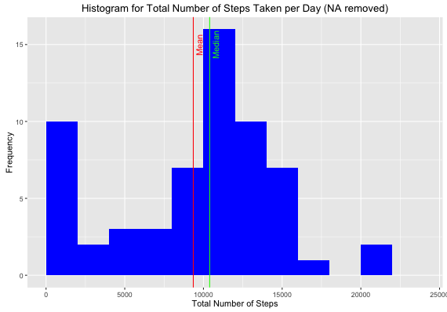
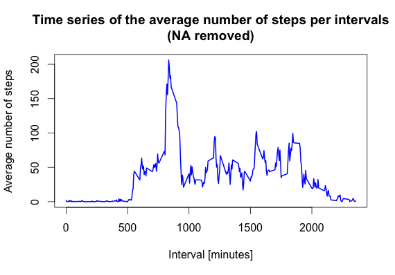
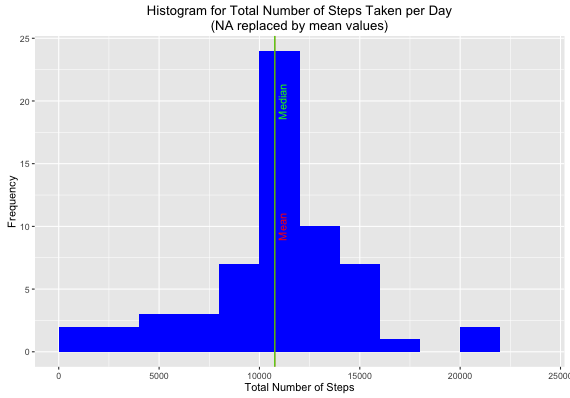
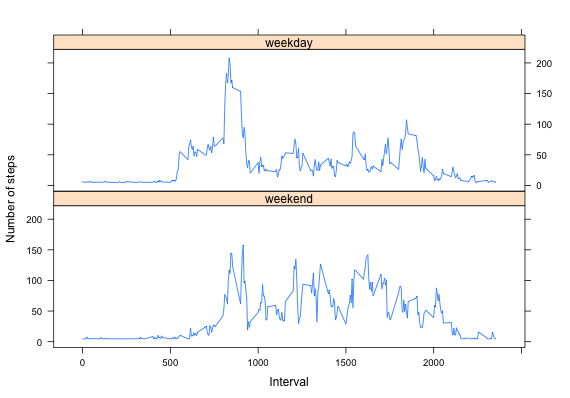

# Reproducible Research: Peer Assessment 1


## Loading and preprocessing the data

#### 1. Load the data (i.e. 'read.csv()')

Download "activity.zip" to have "activity.csv" in your workding directory. 
Set your working directory with command `setwd()`.
Load "activity.csv" into your working directory:
```
if(!file.exists("data")){
    data <- read.csv(file="activity.csv",
    header = TRUE, sep = ",",
    stringsAsFactors = FALSE,
    colClasses = c("numeric","Date","numeric"))
}
```

#### 2. Process/transform the data (if necessary) into a format suitable for your analysis
```
# Set date field as Date for vector variables: weekdays and weekend 
data$date <- as.Date(data$date)
# Create a vector of weekdays
weekdays1 <- c('Monday', 'Tuesday', 'Wednesday', 'Thursday', 'Friday')
# Use `%in%` and `weekdays` to create a logical vector
# Convert to `factor` and specify the `levels/labels`
data$daytype <- factor((weekdays(data$date,abbreviate=FALSE) %in% weekdays1), 
                  levels=c(FALSE, TRUE), labels=c('weekend', 'weekday'))
```

## What is mean total number of steps taken per day?

For this part of the assignment, you can ignore the missing values in the dataset.

#### 1. Calculate the total number of steps taken per day
```
# Load the ggplot2 graphical library
library(ggplot2)

# Create total number of steps taken per day
TotalNumberStepsByDay <- aggregate(x = data$steps,by = list(date=data$date), 
                        FUN = "sum", na.rm=TRUE, na.action=NULL)
```
                        
#### 2. Make a histogram of the total number of steps taken each day
```
# Create histogram for total number of steps taken each day. 
# The code below also includes vertical line for mean and median.
qplot(TotalNumberStepsByDay$x,
      geom = "histogram",
      binwidth = 0.5,
      breaks = seq(from=0,to=25000,by=2000),
      main = "Histogram for Total Number of Steps Taken per Day (NA removed)", 
      xlab = "Total Number of Steps",  
      ylab = "Frequency",
      fill=I("blue"))+
        geom_vline(xintercept=mean(TotalNumberStepsByDay$x, na.rm=TRUE), color="red")+
        geom_text(aes(x=mean(TotalNumberStepsByDay$x, na.rm=TRUE), label="\nMean", y=15), 
            colour="red", angle=90) +
        geom_vline(xintercept=median(TotalNumberStepsByDay$x, na.rm=TRUE), color="green")+
        geom_text(aes(x=median(TotalNumberStepsByDay$x, na.rm=TRUE), label="\nMedian", y=15), 
            colour="green", angle=90)
```

 

#### 3. Calculate and report the mean and median of the total number of steps taken per day
Mean and median vertical lines are included in the histogram above. 
```
> mean(TotalNumberStepsByDay$x, na.rm=TRUE)
[1] 9354.23
> median(TotalNumberStepsByDay$x, na.rm=TRUE)
[1] 10395
```

## What is the average daily activity pattern?

#### 1. Make a time series plot (i.e. 𝚝𝚢𝚙𝚎 = "𝚕") of the 5-minute interval (x-axis) and the average number of steps taken, averaged across all days (y-axis)
```
# Create average daily activity
AverageDailyActivity <- aggregate(x = data$steps,by = list(data$interval), 
                           FUN = "mean", na.rm=TRUE, na.action=NULL)
names(AverageDailyActivity) <- c("interval","mean")
```
 

#### 2. Which 5-minute interval, on average across all the days in the dataset, contains the maximum number of steps?
```
> MaxAverageDailyActivity <- max(AverageDailyActivity$mean, na.rm = TRUE)
> MaxAverageDailyActivity
[1] 206.1698
> IntervalWithMaxAverageDailyActivity <- 
AverageDailyActivity$interval[which(AverageDailyActivity$mean == MaxAverageDailyActivity)]
> IntervalWithMaxAverageDailyActivity
[1] 835
```

## Imputing missing values

Note that there are a number of days/intervals where there are missing values (coded as 𝙽𝙰). The presence of missing days may introduce bias into some calculations or summaries of the data.

#### 1. Calculate and report the total number of missing values in the dataset (i.e. the total number of rows with 𝙽𝙰s)
```
# Find the total of missing values (NA)
TotalMissingValues <- sum(is.na(data$steps))
> TotalMissingValues
[1] 2304
```

#### 2. Devise a strategy for filling in all of the missing values in the dataset. The strategy does not need to be sophisticated. For example, you could use the mean/median for that day, or the mean for that 5-minute interval, etc.
```
# Find the positions of missing values (NA)
PositionsMissingValues <- which(is.na(data$steps))
# Get a vector with the means by limiting lenght to the positions of missing values
VectorOfMeans <- rep(mean(data$steps, na.rm=TRUE), times=length(PositionsMissingValues))
# Replace missing values (NA) with the mean of daily steps
data[PositionsMissingValues, "steps"] <- VectorOfMeans
```

#### 3. Create a new dataset that is equal to the original dataset but with the missing data filled in.
```
# Load the ggplot2 graphical library
library(ggplot2)

# Compute the total number of steps each day (NA values removed)
TotalNumberofStepsImputed <- aggregate(data$steps, by=list(data$date), FUN=sum)
names(TotalNumberofStepsImputed) <- c("date","mean")
```

#### 4. Make a histogram of the total number of steps taken each day and Calculate and report the mean and median total number of steps taken per day. 
```
qplot(TotalNumberofStepsImputed$mean,
           geom = "histogram",
           binwidth = 0.5,
           breaks = seq(from=0,to=25000,by=2000),
           main = "Histogram for Total Number of Steps Taken per Day\n(NA replaced by mean values)", 
           xlab = "Total Number of Steps",  
           ylab = "Frequency",
           fill=I("blue")) +
        geom_vline(xintercept=mean(TotalNumberofStepsImputed$mean, na.rm=TRUE), color="red")+
        geom_text(aes(x=mean(TotalNumberofStepsImputed$mean, na.rm=TRUE), label="\nMean", y=10), 
            colour="red", angle=90) +
        geom_vline(xintercept=median(TotalNumberofStepsImputed$mean, na.rm=TRUE), color="green")+
        geom_text(aes(x=median(TotalNumberofStepsImputed$mean, na.rm=TRUE), label="\nMedian", y=20), 
            colour="green", angle=90)
```
        
 

Do these values differ from the estimates from the first part of the assignment? What is the impact of imputing missing data on the estimates of the total daily number of steps?
```
> mean(TotalNumberofStepsImputed$mean, na.rm=TRUE)
[1] 10766.19
> median(TotalNumberofStepsImputed$mean, na.rm=TRUE)
[1] 10766.19
```
The mean and median of totoal number of steps daily increased from 9354.23 and 10395 to having both values as 10766.19 since we replaced the missing values ("NA") with the mean of daily steps. The impact of the imputing missing data is that the total daily number of steps increased what made the mean and median values increase as well. 

## Are there differences in activity patterns between weekdays and weekends?

For this part the 𝚠𝚎𝚎𝚔𝚍𝚊𝚢𝚜() function may be of some help here. Use the dataset with the filled-in missing values for this part.

#### 1. Create a new factor variable in the dataset with two levels – “weekday” and “weekend” indicating whether a given date is a weekday or weekend day.
```
# Load the lattice graphical library
library(lattice)

# Compute the average number of steps taken, averaged across all daytype variable
MeanStepsTaken <- aggregate(x=data$steps, 
                       by=list(data$daytype,
                               data$interval), FUN="mean", na.rm=TRUE, na.action=NULL)`  
# Rename the column names for mean steps taken
`names(MeanStepsTaken) <- c("daytype", "interval", "mean")
```

#### 2. Make a panel plot containing a time series plot (i.e. 𝚝𝚢𝚙𝚎 = "𝚕") of the 5-minute interval (x-axis) and the average number of steps taken, averaged across all weekday days or weekend days (y-axis). 
```
xyplot(mean ~ interval | daytype, MeanStepsTaken, 
       type="l", 
       lwd=1, 
       xlab="Interval", 
       ylab="Number of steps", 
       layout=c(1,2))
```
 
